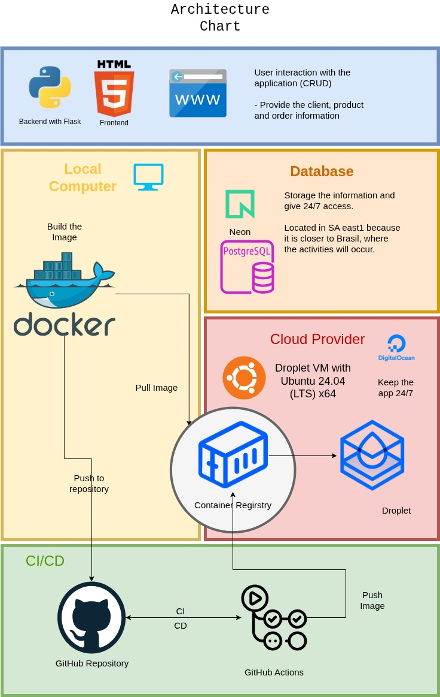

## Sushi Project 

**Languages**: Python, HTML
**Tools**: Claude Code, Docker, Digital Ocean (Droplet and Container Registry) and NEON Database.

Situation: Customer need an automatization of the system to organize better the orders and deliveries. 

Task: Develop an application that supply the customer needs and adapt to the customer technical hability.

 - Architecture: 

<<<<<<< HEAD
<<<<<<< HEAD

=======

>>>>>>> 166e58e9dd4346fb1b75e082e40adbd6907e715d

=======

>>>>>>> edcc17e805c9273128d10e143711929b60dd7791
Action: Used Claude Code to develop the HTML frontend from the application and adapted the structures from frontend over the backend architecture. 

Results: 
