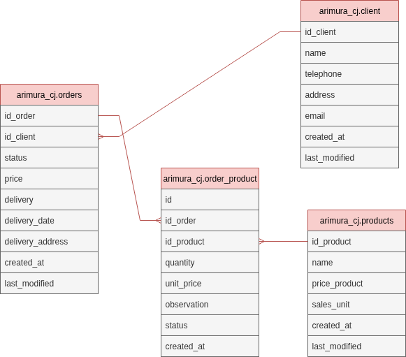
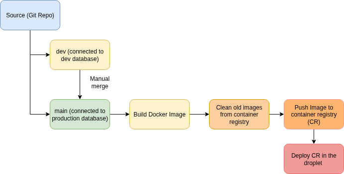

# Restaurant Delivery CRUD

## Project Overview

**arimura_cj** is a Flask/Python web application for business management (clients, products, orders). The frontend was developed with CLAUDE application support, while the Backend and infrastructure was developed by @dentrodailha96. 

### Business Goal

The goal of the application was developing an application which a homemade sushi company could centralize all the data of their business in a single place (database) and stop using Excel files. The challenge was combining the production logistics with the orders update given the need of fresh production. 

### Personal Goal

Improve by practice infrastructure and CICD knowledge. 

### Technologies used

- **Frontend**: HTML
- **Backend**: Python (Flask)
- **Database**: NEON Database (PostgresSQL)
- **Containers**: Docker
- **VM / Cloud Provider**: Digital Ocean (Ubuntu 24.04)
- **CI/CD**: Git Actions

**Extra**: Claude Code

### Infrastructure architecture


## Setup

In order to run this project locally, it is important to run through Docker. 

1) Create and activate virtual environment

2) Install Docker 

3) Given that the project has a database, it is important to create a file called '.env' with the information below referent of your database: 

´´´
DB_HOST = 
DB_NAME = 
DB_USER = 
DB_PASSWORD = 
DB_PORT = 
FLASK_ENV = 
FLASK_DEBUG = 
´´

## Architecture

### Database
- PostgreSQL on Neon.tech, accessed via `psycopg2`
- All tables live in the `arimura_cj` schema (not `public`)
- Schema defined in `sql/schema.sql`
- Tables: `arimura_cj.client`, `arimura_cj.products`, `arimura_cj.orders`, `arimura_cj.order_product`

### Folder Structure

```
arimura_cj/
├── .claude/           # Claude Code configuration and hooks
├── .config/           # Database connection utilities
├── .github/
│   └── workflows/     # GitHub Actions CI/CD pipeline definitions
├── docs/              # Project documentation and diagrams
├── routes/            # Flask route handlers (backend logic)
├── sql/               # SQL schema definition files
├── templates/         # HTML frontend templates
├── .gitignore         # Git ignore rules
├── Dockerfile         # Docker image definition
├── requirements.txt   # Python dependencies
└── site.py            # Application entry point (combines all routes)
```

## Claude Hooks - Data protection
`.claude/settings.json` defines a `PreToolUse` hook that runs `.claude/protect.py` before every tool call. This script blocks Claude from accessing `.env` and `.gitignore`.

## Database Architecture 

- The database was focused on ACID properties. 



## CICD 

- Given the dimension of this project, I decided to go only with a Production and Development environment. The split was done using two branches and defining the local developments as development environment and everything in the VM as production, therefore all the .env documents are adjusted to be connected with the respective databases. 

- The CICD only runs once the manual merge request is done. 

