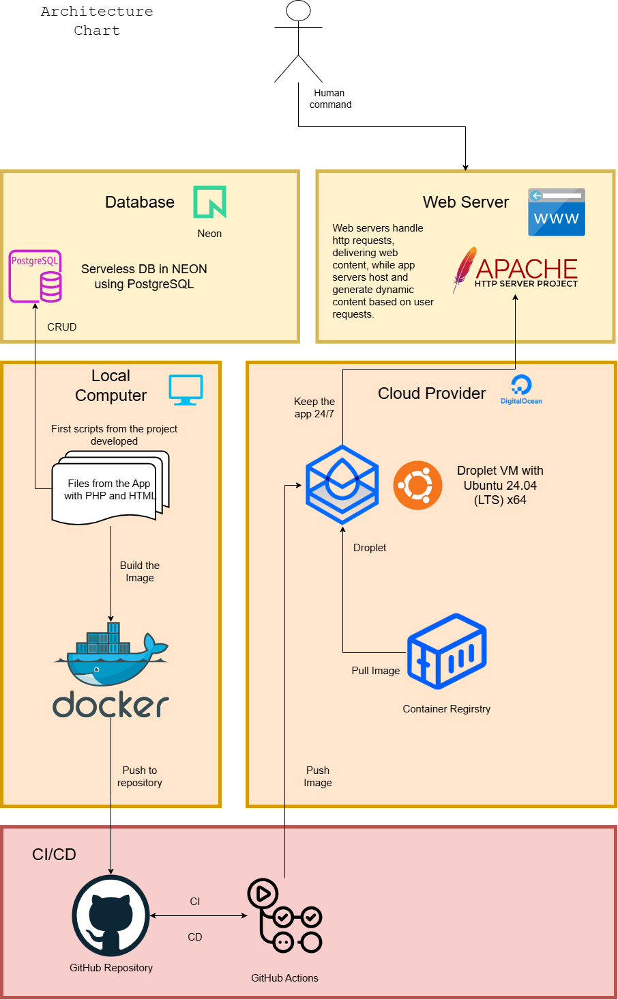

## Sushi Project Delivery app 
### (on going project)

- **Author**: Nakashima, Hiromi and Nakashima, Caio. 

- App created to optimize order from a delivery business. The goal is making a automatic way to write the orders in a database, relating with a fixed or strictic client table and flexible product table. 
The app destined to internal use from the business.

- **Project**:

Until the moment, the concept is based on: local dev → [Docker image build](https://dev.to/dentrodailha96/leanings-docker-and-it-perks-33if) → push to GitHub → [Actions triggers](https://dev.to/dentrodailha96/connecting-docker-to-digital-ocean-droplet-using-git-actions-5k0) → image pushed to Container Registry → [Droplet](https://dev.to/dentrodailha96/learning-creating-a-ubuntu-droplet-4o7g) pulls and runs.

- **Tech Stack**: PHP, HTML, Docker, Apache, NEON (PostgreSQL), DigitalOcean Droplet (Ubuntu 24.04), GitHub Actions CI/CD, Container Registry.

